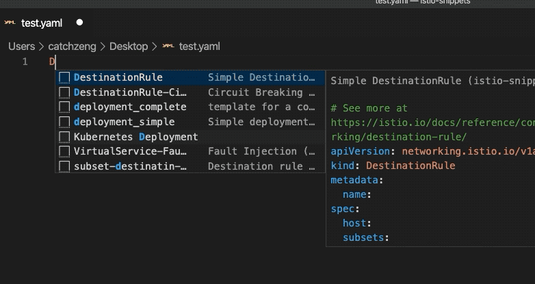
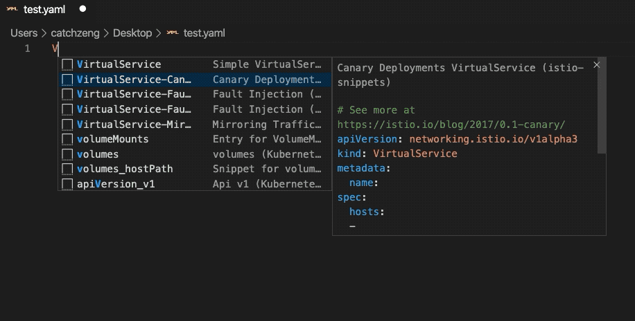
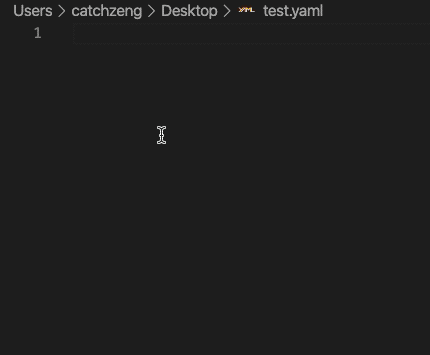
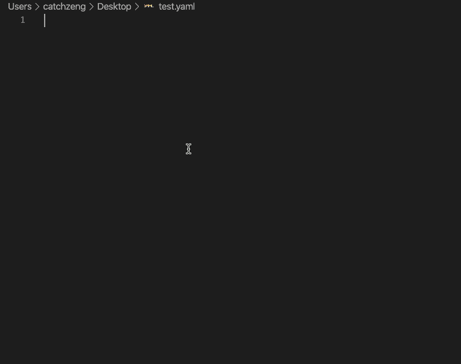

# istio-snippets

Code snippets of istio for visual studio code.

## Features

- [x] DestinationRule
- [x] VirtualService
- [x] ServiceEntry
- [x] Gateway

## Requirements

- `apiVersion: networking.istio.io/v1alpha3`

## Usage

Enter the CRD name in the yaml file and the corresponding code snippets will appear.

### DestinationRule

### VirtualService

### ServiceEntry

### Gateway

